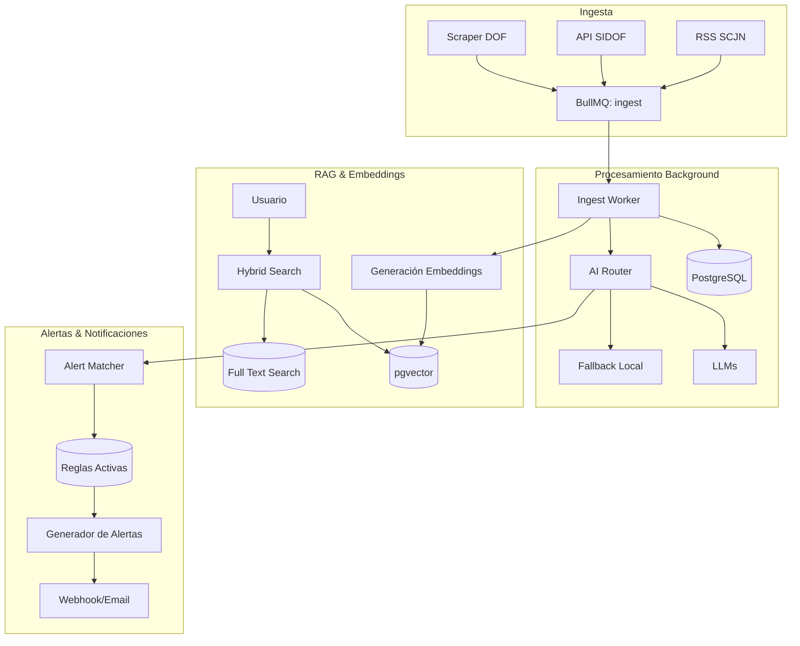

# Jurídico Radar ⚖️

Plataforma integral de inteligencia regulatoria para México. Monitorea, analiza, indexa y alerta sobre publicaciones oficiales del Diario Oficial de la Federación (DOF), Sistema de Información del DOF (SIDOF) y Suprema Corte de Justicia de la Nación (SCJN) usando Inteligencia Artificial.

## Arquitectura del Proyecto

Este proyecto está diseñado para funcionar como un sistema robusto de procesamiento de documentos en tiempo real, utilizando arquitecturas modernas para escalabilidad y mantenibilidad.



## Stack Tecnológico

- **Core & API**: Next.js (App Router), TypeScript, Node.js
- **Base de Datos**: PostgreSQL con la extensión `pgvector` para búsqueda semántica.
- **ORM**: Prisma
- **Colas y Tareas (Background Jobs)**: BullMQ + Redis
- **Inteligencia Artificial**: AI Router con soporte para múltiples proveedores (Gemini, OpenRouter, Groq) y fallback local 100% determinístico y gratuito.
- **Testing**: Node.js Native Test Runner (`node:test`)
- **Estilos de UI**: Vanilla CSS con Glassmorphism premium y CSS Variables.

## Características Principales

1. **Ingesta Híbrida Inteligente**: Combinación de Web Scraping, APIs oficiales y feeds RSS para capturar todo el universo regulatorio mexicano con alta tolerancia a fallos.
2. **Procesamiento Asíncrono Robusto**: Uso intensivo de colas con BullMQ para procesar miles de documentos sin saturar la base de datos ni las APIs externas.
3. **Clasificación y Resúmenes con IA**: Cada documento es analizado por Modelos de Lenguaje para determinar la materia legal, entidades involucradas, impacto y generar resúmenes amigables.
4. **Búsqueda Vectorial (RAG)**: Búsqueda híbrida y semántica en milisegundos gracias a `pgvector`, permitiendo consultas naturales (Ej. "¿Cuáles son las obligaciones fiscales publicadas ayer?").
5. **Alertas Proactivas**: Sistema de "Watchlists" que evalúa nuevos documentos en tiempo real contra las reglas del usuario y envía notificaciones por webhook o email.

## ¿Por qué esta arquitectura?

* **Desacoplamiento mediante BullMQ**: En el ámbito legal, los sitios oficiales pueden ser inestables. BullMQ proporciona un mecanismo de *Dead Letter Queue (DLQ)*, reintentos exponenciales y control de concurrencia que previene pérdida de datos y OOM (Out Of Memory).
* **RAG local con pgvector**: En lugar de depender de servicios costosos como Pinecone o Weaviate, usar `pgvector` en PostgreSQL permite tener datos relacionales y embeddings en la misma base de datos, lo que permite consultas híbridas eficientes y atómicas con Prisma.
* **AI Router Agnostic**: Previene el *vendor lock-in*. Permite usar el modelo más barato para tareas sencillas y el más poderoso para RAG. El fallback local garantiza que los tests de CI pasen sin necesidad de credenciales expuestas, logrando un entorno 100% auditable.

## Setup Local

### Requisitos
- Docker y Docker Compose
- Node.js 22.x

### Instalación

1. Clona el repositorio e instala las dependencias:
```bash
git clone <tu-repo>
cd juridico-radar
nvm use 22
npm ci
```

2. Configura las variables de entorno:
```bash
cp .env.example .env
```

3. Ajusta las URLs locales como se explica en `docs/DEPLOYMENT.md` y levanta PostgreSQL, Redis y pgvector:
```bash
docker compose up -d postgres redis
```

4. Ejecuta las migraciones versionadas de Prisma:
```bash
npm run db:migrate
```

5. Inicia el servidor local:
```bash
npm run dev
```

6. Inicia el worker local en otra terminal (necesario para embeddings y procesamiento):
```bash
npm run worker
```

### Ejecutar Tests
```bash
npm test
```

La guía completa de desarrollo, pruebas de producción, backups, Render y VPS está en [`docs/DEPLOYMENT.md`](docs/DEPLOYMENT.md). `docker-compose.yml` es sólo para desarrollo; producción usa `docker-compose.prod.yml`.
