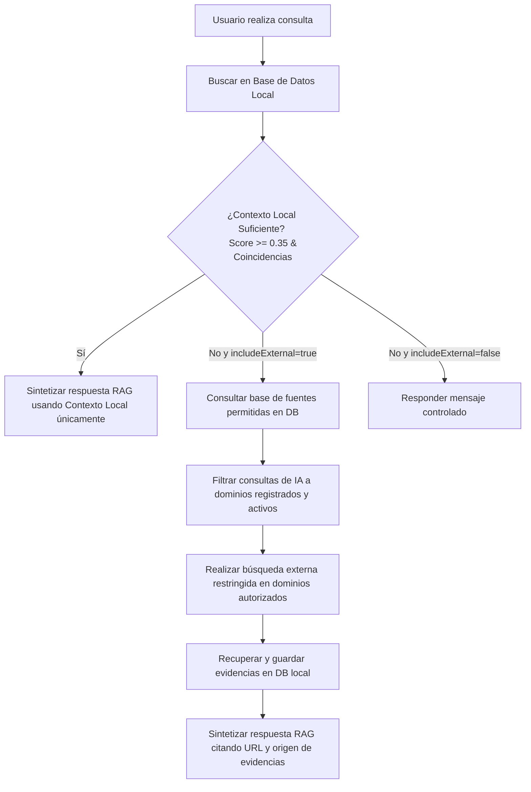

# Registro y Gestión de Fuentes Oficiales

Este documento detalla el diseño, la configuración y el funcionamiento del sistema de administración de Fuentes Oficiales en **Jurídico Radar**. El objetivo principal es migrar de fuentes integradas de forma estática (hardcoded) a fuentes dinámicas y administrables a través de base de datos sin perder seguridad ni precisión en el pipeline de RAG (Retrieval-Augmented Generation).

---

## 1. Tipos de Fuentes Soportadas

El sistema permite registrar fuentes oficiales asignándoles un tipo/adaptador y un modo de ingesta:

| Adaptador / Tipo | Descripción | Modo de Ingesta |
| :--- | :--- | :--- |
| `sidof` | Ingestor nativo del Sistema de Información del Diario Oficial de la Federación. | `api` (Nativo) |
| `diputados` | Ingestor nativo del portal de la Cámara de Diputados para Leyes Federales. | `api` (Nativo) |
| `scjn_sjf` | Ingestor nativo de Tesis y Jurisprudencias del Semanario Judicial de la Federación. | `api` (Nativo) |
| `scjn_leg` | Ingestor nativo de Legislación de la SCJN. | `api` (Nativo) |
| `dof_web` | Ingestor nativo de scraping web del Diario Oficial de la Federación. | `api` (Nativo) |
| `rss` | Canal de sindicación RSS genérico que expone un feed en formato XML. | `rss` |
| `manual_url` | Página web única cuya estructura HTML se descarga y limpia de forma controlada. | `manual_url` |
| `search_only` | Fuentes sin ingesta periódica activa que solo se consultan en caliente durante RAG. | `search_only` |

---

## 2. Validación de Seguridad (SSRF)

Para evitar vulnerabilidades de tipo **Server-Side Request Forgery (SSRF)**, cada vez que se agrega o edita una fuente, se valida su URL a través de `lib/security/urlValidation.ts` bajo las siguientes reglas:

1. **Protocolo Obligatorio**: Solo se permiten URLs que utilicen de forma explícita el protocolo HTTPS (`https://`). Protocolos peligrosos como `http://`, `file://`, `data:`, o `javascript:` son rechazados inmediatamente.
2. **Normalización y Resolución DNS**: Se extrae el hostname y se realiza una resolución DNS activa (`dns.resolve4` y `dns.resolve6`) para inspeccionar la dirección IP destino real. Esto evita ataques de evasión mediante bypass de nombres de dominio o DNS dinámicos.
3. **Bloqueo de IPs Prohibidas**: Se rechaza la petición si la dirección IP resuelta pertenece a rangos reservados o privados:
   - Loopback / Localhost: `127.0.0.1`, `::1`, `localhost`
   - IPs Privadas (RFC1918): `10.0.0.0/8`, `172.16.0.0/12`, `192.168.0.0/16`
   - IPv6 de enlace local y locales únicas: `fe80::/10`, `fc00::/7`
   - Metadata de proveedores Cloud: `169.254.169.254`
4. **Restricción de Redirecciones**: La petición se realiza usando una función de transporte segura (`safeFetch`) que limita el número de redirecciones (máximo 3 hops), re-validando la seguridad SSRF de la IP de destino en cada salto.
5. **Límites Operativos**: Se imponen límites estrictos para prevenir denegaciones de servicio (DoS) del servidor:
   - Timeout máximo de conexión y lectura: 5 segundos.
   - Tamaño máximo del cuerpo de respuesta: 5 MB.
6. **Triple Validación**: Las comprobaciones de seguridad se realizan de forma obligatoria en tres momentos del ciclo de vida:
   - Al **crear** o **editar** una fuente oficial.
   - Al **probar la conexión** mediante el botón administrativo.
   - Al **ejecutar la ingesta** (manual o programada).

---

## 3. Administración y Flujo CRUD

Los endpoints administrativos están protegidos con la función `requireAdmin` (validando el encabezado `x-admin-token`):

- **Listar fuentes**: `GET /api/admin/sources`
  - Retorna las fuentes registradas junto con sus últimas 5 bitácoras de sincronización (`OfficialSourceFetchLog`).
- **Registrar fuente**: `POST /api/admin/sources`
  - Normaliza el slug, valida unicidad y aplica validación SSRF a la URL base.
- **Actualizar fuente**: `PATCH /api/admin/sources/[id]`
  - Permite modificar metadatos y re-valida SSRF si la URL cambia.
- **Desactivar fuente**: `DELETE /api/admin/sources/[id]`
  - Aplica un **borrado lógico** (`isActive = false`) para suspender ingestas y búsquedas de forma inmediata sin perder historial.
- **Catálogo Público**: `GET /api/sources`
  - Endpoint público de solo lectura que expone únicamente metadatos seguros de fuentes activas (nombre, tipo, nivel de confianza, etc.), ocultando IDs internos, logs, credenciales u opciones operativas sensibles.

---

## 4. Pruebas de Conexión e Ingesta Manual

- **Probar Conexión**: `POST /api/admin/sources/[id]/test`
  - Realiza un ping seguro (`safeFetch` + SSRF) en caliente para comprobar la disponibilidad física de la URL sin persistir ningún documento ni modificar el estado del sistema.
- **Ingesta Manual**: `POST /api/admin/sources/[id]/ingest`
  - Desencadena de forma inmediata el crawler para la fuente jurídica seleccionada. Registra los resultados del intento en `OfficialSourceFetchLog`.

---

## 5. Deduplicación de Documentos

Durante la ingesta, los documentos recuperados pasan por un pipeline de normalización e idempotencia:

1. Se genera un identificador único para el item (basado en la URL base o slug + identificador nativo de la publicación).
2. Se calcula un hash SHA-256 del contenido crudo (`contentHash`).
3. El documento se procesa a través de la función `saveDedupedItem`:
   - Si no existe un item con la misma URL, se inserta en la base de datos.
   - Si ya existe un item con la misma URL pero diferente hash de contenido, se crea una nueva versión (`DocumentVersion`) y se calcula la diferencia (`NormaDiff`), permitiendo el rastreo de reformas y modificaciones.
   - Si el hash coincide, el item se identifica como duplicado y se omite la inserción.

---

## 6. Integración con RAG Seguro

El pipeline de búsqueda e inteligencia artificial se rige por un flujo restrictivo y jerárquico:

### Reglas de Seguridad en Consulta Externa
1. **Dominios Regulados por el Backend**: La lista de dominios y sitios autorizados se compila de forma dinámica a partir de las fuentes oficiales activas en la base de datos (`OfficialSource`). La IA de expansión de consultas tiene estrictamente prohibido proponer o inventar dominios de búsqueda externos.
2. **Restricción Estricta en Buscadores**: Las consultas externas (usando Tavily) se ejecutan concatenando de forma programática el operador de restricción `site:<dominio_permitido>`.
3. **Validación de Resultados**: Al retornar resultados de un buscador externo, el backend valida que la URL devuelta pertenezca al dominio autorizado antes de pasarla al contexto o almacenarla en la base de datos.

### Evitación de Alucinaciones Jurídicas
Para garantizar la veracidad de las consultas jurídicas, el prompt del LLM incorpora instrucciones estrictas:
- **Respuesta controlada**: Si los resultados locales y externos no proveen evidencia factual para responder la pregunta, el sistema devuelve exactamente el mensaje: **"No se encontró evidencia suficiente en fuentes oficiales registradas."**
- **Cero invención**: El modelo no puede inventar leyes, tesis, reformas, artículos, fechas o enlaces. Cualquier afirmación debe estar anclada a un documento recuperado con su correspondiente URL.
