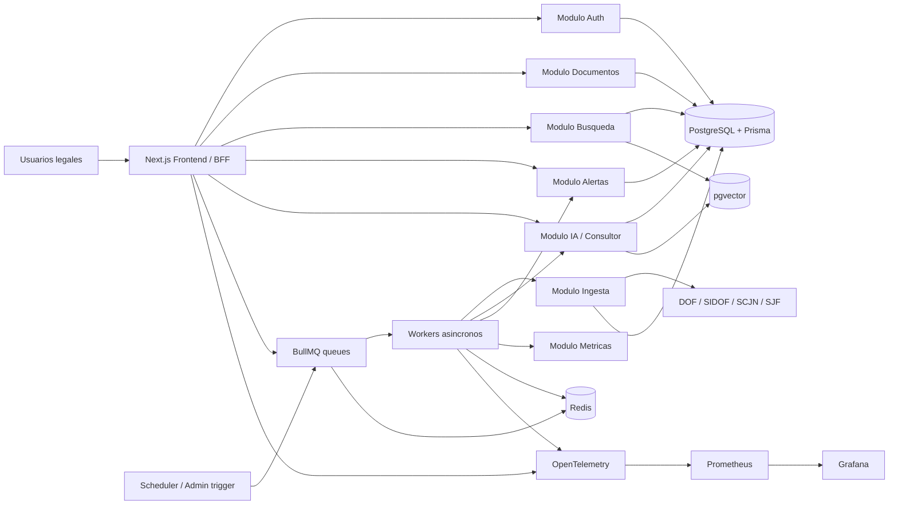
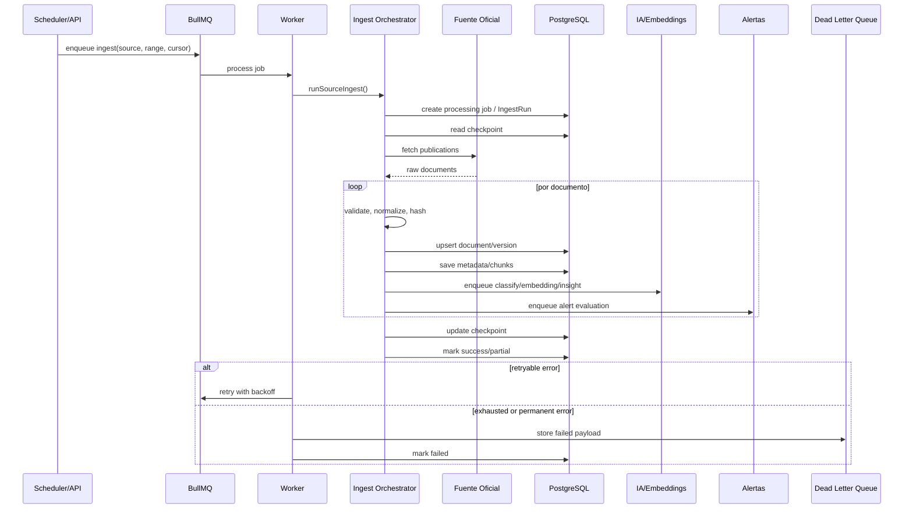

# Juridico Radar - Blueprint tecnico profesional

> Generado por Codex / The Architect el 2026-06-15  
> Arquetipo: SaaS Web App legal-tech con pipeline de datos, IA aplicada y busqueda regulatoria

## 1. Resumen ejecutivo

Juridico Radar es una plataforma SaaS de inteligencia regulatoria para Mexico. Su objetivo es monitorear fuentes oficiales como DOF/SIDOF, SCJN/SJF, legislacion y publicaciones gubernamentales; procesar documentos legales; clasificarlos por impacto, materia y tipo; y convertirlos en alertas, busquedas y reportes ejecutivos para equipos legales, fiscales, de cumplimiento y recursos humanos.

El problema es claro: empresas, despachos y areas juridicas revisan manualmente publicaciones oficiales dispersas para detectar reformas, criterios, acuerdos o avisos que pueden afectar su operacion. Ese proceso es lento, repetitivo, dificil de auditar y propenso a omisiones. Juridico Radar reduce el tiempo entre publicacion oficial e interpretacion accionable.

Como proyecto de portafolio es fuerte porque demuestra producto real, arquitectura full-stack, ingesta de datos, normalizacion documental, colas, deduplicacion, busqueda, IA aplicada con guardrails, observabilidad, seguridad multi-tenant, testing y decisiones tecnicas defendibles en entrevistas.

Frase para CV / LinkedIn:

> Disene y desarrolle Juridico Radar, un SaaS legal-tech en Next.js, Prisma, PostgreSQL, BullMQ e IA que ingiere publicaciones oficiales mexicanas, clasifica impacto juridico, genera resumenes ejecutivos, detecta cambios normativos y habilita alertas para equipos legales y de cumplimiento.

## 2. Alcance del producto

### Usuarios objetivo

- Abogados corporativos: seguimiento de reformas, contratos, gobierno corporativo y obligaciones regulatorias.
- Despachos juridicos: vigilancia por cliente, materia, industria o autoridad; preparacion de newsletters y alertas.
- Equipos de cumplimiento: deteccion temprana de obligaciones, plazos, sanciones y cambios operativos.
- Consultores fiscales: monitoreo de SAT, DOF, reformas fiscales, criterios y jurisprudencia.
- Recursos humanos: cambios laborales, seguridad social, NOMs, IMSS, INFONAVIT y obligaciones patronales.
- Empresas reguladas: salud, financiero, energia, telecom, fintech, manufactura y sectores con autorizaciones.

### Casos de uso principales

- Monitorear publicaciones oficiales por fuente, fecha, autoridad, materia, tipo e impacto.
- Buscar documentos legales por texto, filtros y, en la version avanzada, por significado semantico.
- Recibir alertas por tema, autoridad, norma, sector, cliente o palabra clave.
- Consultar resumenes ejecutivos con cambios clave, riesgos, partes afectadas y siguientes pasos.
- Preguntar en lenguaje natural sobre documentos usando RAG con citas.
- Analizar impacto potencial de una publicacion para areas legales, fiscales, laborales o regulatorias.
- Medir tendencias: fuentes mas activas, temas con mayor volumen, normas mas modificadas y documentos de alto impacto.

## 3. Arquitectura general

### Recomendacion para un desarrollador individual

La ruta recomendada es un monolito modular en Next.js 16 App Router, TypeScript, Prisma/PostgreSQL y Redis/BullMQ para trabajos asincronos. El repositorio ya camina en esa direccion: `app/` contiene UI y route handlers, `lib/ingest/` orquesta la ingesta, `lib/sources/` encapsula conectores, `worker/ingestWorker.ts` procesa jobs, `prisma/schema.prisma` modela items, normas, usuarios, organizaciones, watchlists, notificaciones, metricas e insights.

Esta arquitectura permite construir rapido sin cerrar la puerta a una evolucion enterprise. El principio es separar dominios por modulo, no por servicio prematuramente.

### Evaluacion de estilos

| Enfoque | Decision | Por que | Problema que resuelve | Alternativa | Ventajas | Desventajas | Cuando escalar |
|---|---|---|---|---|---|---|---|
| Monolito modular | Usar primero | Menor complejidad operativa para un solo desarrollador | Entrega end-to-end con menos DevOps | Microservicios | Rapido, tipado compartido, facil debug | Puede crecer demasiado | Cuando ingesta, busqueda o IA necesiten escalar separados |
| Microservicios | No iniciar aqui | Seria sobreingenieria para MVP | Separacion extrema de ownership/carga | Modulos + workers | Escala por dominio | Red, versionado, despliegues, observabilidad compleja | Con clientes enterprise o volumen alto |
| Event-driven | Parcial con BullMQ | El dominio es naturalmente asincrono | Ingesta, notificaciones e IA desacopladas | Kafka/NATS/SQS | Reintentos, jobs, aislamiento | Consistencia eventual | Migrar a bus formal cuando haya multiples servicios |
| CQRS parcial | Mas adelante | Busqueda y reporting pueden requerir modelos de lectura | Lecturas complejas sin afectar escritura | Vistas/materialized views | Rendimiento de consultas | Duplicacion de modelos | Cuando dashboards y search p95 degraden |
| Workers asincronos | Usar desde MVP | PDF, scraping, IA y alertas no deben bloquear requests | Procesamiento pesado y reintentos | Cron inline | Resiliencia, backoff, DLQ | Mas piezas locales | Siempre para tareas lentas/costosas |

### Capas recomendadas

- Frontend/BFF: Next.js App Router, Server Components, route handlers y acciones internas.
- Dominio: modulos `ingest`, `sources`, `normas`, `consultant`, `notifications`, `metrics`, `search`.
- Persistencia: PostgreSQL con Prisma; pgvector en etapa avanzada.
- Asincronia: Redis + BullMQ para ingesta, notificaciones, embeddings, metricas y DLQ.
- IA: proveedor configurable, fallback deterministico, prompts versionados, logs de input hash y citas.
- Observabilidad: logs JSON, OpenTelemetry, Prometheus y Grafana.



## 4. Pipeline de ingesta y procesamiento

El pipeline debe ser idempotente, observable y recuperable. En el repo actual, la base existe con `runIngest`, `sourceRegistry`, checkpoints, `saveDedupedItem`, `IngestRun`, worker BullMQ y fuentes oficiales.

### Flujo propuesto

1. Un scheduler, endpoint interno o boton admin encola un job BullMQ con `source`, rango temporal, cursor y opciones.
2. El worker consume el job y crea un registro `processing_jobs` o `IngestRun`.
3. Carga checkpoint por fuente para continuar sin reprocesar todo.
4. El adaptador consulta fuentes oficiales: SIDOF, DOF, SCJN, SJF, Camara de Diputados u otras.
5. Descarga publicaciones y valida integridad: status HTTP, MIME, tamano, hash, fecha, URL canonica.
6. Detecta duplicados por `source + sourceId`, `canonicalUrl`, `url` y `contentHash`.
7. Guarda documento original o referencia `rawRef` en storage local/S3 compatible.
8. Extrae texto de PDFs o HTML; registra errores de OCR/extraccion.
9. Extrae metadatos: autoridad, fecha, tipo, materia, sector, norma, articulos, vigencia.
10. Normaliza datos a un modelo canonico.
11. Clasifica por tipo, tema, impacto y categoria.
12. Genera versiones normativas y diffs cuando detecta reformas.
13. Divide texto en chunks citables.
14. Genera embeddings para busqueda semantica.
15. Indexa FTS y vector search.
16. Emite eventos logicos: `DocumentIngested`, `DocumentClassified`, `WatchlistMatched`, `InsightRequested`.
17. Evalua alertas y encola notificaciones.
18. Actualiza checkpoint solo despues de commits exitosos.
19. Cierra job con metricas: encontrados, guardados, duplicados, fallos, duracion y costo.

### Reintentos y DLQ

- Usar `jobId` deterministico por fuente/rango/cursor.
- Backoff exponencial con jitter para errores transitorios: timeout, 429, 5xx, DNS.
- Errores permanentes van a DLQ: schema incompatible, PDF corrupto, URL invalida.
- Guardar payload, fuente, cursor, intento, error normalizado y stack reducido.
- Permitir replay selectivo desde DLQ sin duplicar documentos.
- Bloquear ingestas concurrentes de la misma fuente/ventana con lock Redis.



## 5. Modelo de datos

El modelo actual debe evolucionar de `Item` + `Norma` hacia documentos canonicos versionados, multi-tenant y preparados para RAG. No hay que borrar de golpe el modelo existente: conviene migrar por compatibilidad, usando `Item` como fuente operacional hasta consolidar `Document`.

| Tabla | Campos principales | Explicacion |
|---|---|---|
| `users` | `id`, `email`, `name`, `created_at`, `last_login_at`, `status` | Usuarios del SaaS. |
| `organizations` | `id`, `name`, `slug`, `plan`, `rfc`, `daily_notification_limit`, `created_at` | Clientes, despachos o empresas. |
| `org_user_roles` | `id`, `organization_id`, `user_id`, `role` | RBAC por organizacion: owner, admin, analyst, viewer. |
| `documents` | `id`, `source`, `jurisdiction`, `document_type`, `title`, `canonical_key`, `canonical_url`, `status` | Documento legal canonico. |
| `document_versions` | `id`, `document_id`, `published_at`, `effective_from`, `content_hash`, `raw_ref`, `raw_text`, `diff_summary` | Versiones historicas y trazabilidad. |
| `document_metadata` | `id`, `document_id`, `key`, `value`, `normalized_value`, `confidence` | Metadatos flexibles: dependencia, materia, sector, autoridad. |
| `document_chunks` | `id`, `document_version_id`, `chunk_index`, `section_path`, `article`, `text`, `token_count`, `citation_anchor` | Fragmentos citables para FTS, RAG y evidencias. |
| `embeddings` | `id`, `chunk_id`, `model`, `embedding`, `created_at` | Vectores pgvector por chunk/modelo. |
| `alert_rules` | `id`, `organization_id`, `user_id`, `name`, `query`, `filters`, `rule_type`, `frequency`, `enabled` | Reglas de alerta por keyword, IA, tema o busqueda semantica. |
| `notifications` | `id`, `alert_rule_id`, `user_id`, `document_version_id`, `channel`, `status`, `sent_at`, `error` | Envio y dedupe de notificaciones. |
| `processing_jobs` | `id`, `type`, `source`, `status`, `attempt`, `started_at`, `finished_at`, `error`, `metadata` | Ingesta, PDF, chunking, embeddings, RAG, notificaciones. |
| `audit_logs` | `id`, `organization_id`, `user_id`, `action`, `entity_type`, `entity_id`, `ip`, `created_at` | Auditoria de acciones sensibles. |

Relaciones clave:

- Una organizacion tiene usuarios mediante roles.
- Un documento tiene muchas versiones.
- Una version tiene muchos chunks.
- Un chunk puede tener embeddings por modelo.
- Una alerta pertenece a organizacion y opcionalmente a usuario.
- Una notificacion referencia regla, usuario y version documental.
- Un job registra estado operacional del pipeline.
- Audit logs registran administracion, busquedas, consultas IA, exportaciones y cambios de alertas.

Ejemplo Prisma:

```prisma
model Document {
  id           String   @id @default(cuid())
  source       String
  jurisdiction String
  documentType String
  title        String
  canonicalKey String   @unique
  canonicalUrl String?  @unique
  status       String   @default("active")
  createdAt    DateTime @default(now())
  updatedAt    DateTime @updatedAt
  versions     DocumentVersion[]
  metadata     DocumentMetadata[]
}

model DocumentVersion {
  id            String   @id @default(cuid())
  documentId    String
  document      Document @relation(fields: [documentId], references: [id], onDelete: Cascade)
  publishedAt   DateTime?
  effectiveFrom DateTime?
  contentHash   String
  rawRef        String?
  rawText       String?
  diffSummary   Json?
  chunks        DocumentChunk[]

  @@unique([documentId, contentHash])
  @@index([publishedAt])
}

model DocumentChunk {
  id                String @id @default(cuid())
  documentVersionId String
  documentVersion   DocumentVersion @relation(fields: [documentVersionId], references: [id], onDelete: Cascade)
  chunkIndex        Int
  sectionPath       String?
  article           String?
  text              String
  tokenCount        Int
  citationAnchor    String?
  embeddings        Embedding[]

  @@unique([documentVersionId, chunkIndex])
}

model Embedding {
  id        String   @id @default(cuid())
  chunkId   String
  chunk     DocumentChunk @relation(fields: [chunkId], references: [id], onDelete: Cascade)
  model     String
  embedding Unsupported("vector(1536)")
  createdAt DateTime @default(now())

  @@unique([chunkId, model])
}
```

Ejemplo SQL:

```sql
CREATE EXTENSION IF NOT EXISTS vector;

CREATE TABLE document_chunks (
  id uuid PRIMARY KEY,
  document_version_id uuid NOT NULL REFERENCES document_versions(id),
  chunk_index int NOT NULL,
  section_path text,
  article text,
  text text NOT NULL,
  token_count int NOT NULL,
  citation_anchor text,
  search_vector tsvector GENERATED ALWAYS AS (
    to_tsvector('spanish', coalesce(section_path,'') || ' ' || coalesce(article,'') || ' ' || text)
  ) STORED
);

CREATE TABLE embeddings (
  id uuid PRIMARY KEY,
  chunk_id uuid NOT NULL REFERENCES document_chunks(id),
  model text NOT NULL,
  embedding vector(1536) NOT NULL,
  created_at timestamptz DEFAULT now()
);

CREATE INDEX document_chunks_fts_idx ON document_chunks USING gin(search_vector);
CREATE INDEX embeddings_vector_idx ON embeddings USING hnsw (embedding vector_cosine_ops);
```

## 6. Inteligencia artificial aplicada

La IA debe operar como capa asistida, no como fuente de verdad. La fuente de verdad son documentos oficiales, versiones, metadatos, chunks citables y diffs auditables.

### Funcionalidades

- Clasificacion automatica por materia legal: fiscal, laboral, administrativo, civil/familiar, penal, financiero, ambiental, salud, energia.
- Resumen ejecutivo: que cambio, por que importa, a quien afecta, que revisar.
- Extraccion de entidades: autoridad, norma, articulos, fechas, sectores, sujetos obligados, sanciones, plazos.
- Identificacion de sectores afectados: salud, financiero, RH, manufactura, telecom, energia, fintech.
- Analisis de impacto: alto/medio/bajo con razones observables.
- Relacion entre normas: reforma, adicion, derogacion, abrogacion, referencia cruzada.
- Preguntas y respuestas con RAG: respuestas con citas y limites explicitos.

### Implementacion RAG

1. Chunking por estructura legal: titulo, capitulo, articulo, fraccion, inciso; fallback por tokens.
2. Embeddings por chunk, registrando modelo y fecha para reindexar.
3. Busqueda hibrida: FTS + pgvector + filtros estructurados.
4. Reranking de top 50-100 candidatos con prioridad por vigencia, jurisdiccion, fuente y similitud.
5. Prompt controlado: responder solo con evidencia recuperada.
6. Citacion de fuentes: documento, fuente, fecha, articulo/seccion y URL.
7. Guardrails: no inventar articulos, plazos, sanciones, fechas ni obligaciones.
8. Auditoria: guardar prompt version, modelo, input hash, chunks usados, costo aproximado y confianza.

Prompt base:

```text
Eres un asistente legal para Juridico Radar.
Responde unicamente con base en los fragmentos recuperados.
Incluye citas por documento, articulo/seccion y fecha cuando esten disponibles.
Si la evidencia es insuficiente o contradictoria, dilo explicitamente.
No inventes obligaciones, plazos, sanciones ni fuentes.
Aclara que no sustituyes asesoria legal profesional.
```

Mitigaciones de riesgo IA:

- No enviar datos de otro tenant al contexto del modelo.
- Detectar instrucciones maliciosas dentro de documentos ingeridos.
- Tratar documentos como datos no confiables, no como instrucciones.
- Exigir fuentes para cada afirmacion sustantiva.
- Responder "no hay evidencia suficiente" cuando retrieval no alcance umbral.
- Mostrar advertencia: el sistema no sustituye asesoria legal profesional.

## 7. Busqueda avanzada

La busqueda inicial debe vivir en PostgreSQL con Full-Text Search y pgvector. Mantiene el sistema simple, auditable y cercano al modelo transaccional.

### Capacidades

- PostgreSQL Full-Text Search para terminos exactos, articulos, siglas, dependencias y nombres oficiales.
- pgvector para intencion semantica: "obligaciones para patrones", "impacto fiscal para empresas", "riesgos ambientales".
- Filtros: fecha, dependencia, fuente, tema, tipo de documento, sector, jurisdiccion, vigencia e impacto.
- Ranking combinado: lexical score, vector score, frescura, autoridad y vigencia.
- Reranking para respuestas IA o busquedas criticas.

Ejemplo de ranking:

```sql
WITH lexical AS (
  SELECT id, ts_rank(search_vector, plainto_tsquery('spanish', $1)) AS score
  FROM document_chunks
  WHERE search_vector @@ plainto_tsquery('spanish', $1)
),
semantic AS (
  SELECT c.id, 1 - (e.embedding <=> $2::vector) AS score
  FROM embeddings e
  JOIN document_chunks c ON c.id = e.chunk_id
  ORDER BY e.embedding <=> $2::vector
  LIMIT 100
)
SELECT c.*
FROM document_chunks c
LEFT JOIN lexical l ON l.id = c.id
LEFT JOIN semantic s ON s.id = c.id
ORDER BY coalesce(l.score, 0) * 0.45 + coalesce(s.score, 0) * 0.45 DESC
LIMIT 20;
```

### Cuando migrar a OpenSearch o Elasticsearch

Mantener Postgres + pgvector mientras el corpus y la carga sean manejables. Migrar o complementar con OpenSearch cuando existan:

- Millones de chunks con p95 inestable.
- Necesidad fuerte de facetas, highlighting, sinonimos, analyzers juridicos y boosting complejo.
- Concurrencia alta multi-tenant.
- Relevancia y observabilidad de ranking como producto central.
- Indexacion externa a gran escala.

OpenSearch debe ser indice especializado, no reemplazo del modelo relacional ni del historial normativo.

## 8. Sistema de alertas

El sistema de alertas debe evolucionar de `Watchlist` y `NotificationLog` a reglas expresivas por usuario/organizacion.

Ejemplos de reglas:

- "Notificame sobre cambios fiscales."
- "Avisame sobre normas laborales."
- "Mandame alertas de documentos emitidos por el SAT."
- "Avisame si una publicacion afecta al sector salud."
- "Resume diariamente cambios de alto impacto para mi organizacion."

Canales:

- Correo electronico.
- Notificaciones dentro de la app.
- Webhooks.
- Resumen diario/semanal.
- En etapa avanzada: Slack/Teams.

Tipos de regla:

- Keyword: texto exacto en titulo, resumen o cuerpo.
- Clasificacion IA: tema, impacto, sector, autoridad.
- Norma: coincidencia contra norma, sigla o alias.
- Busqueda semantica: similitud contra una descripcion de interes.
- Mixta: filtros estructurados + query + umbral de impacto.

Evento recomendado:

```json
{
  "event": "watchlist.matched",
  "version": "v1",
  "organizationId": "org_123",
  "userId": "usr_123",
  "alertRuleId": "rule_123",
  "documentVersionId": "docver_123",
  "reasons": ["tema:fiscal", "autoridad:SAT", "impacto:alto"],
  "source": "DOF",
  "publishedAt": "2026-06-15T12:00:00.000Z"
}
```

Webhook payload:

```json
{
  "id": "notif_123",
  "type": "regulatory_alert",
  "document": {
    "title": "Acuerdo publicado en el Diario Oficial",
    "source": "DOF",
    "url": "https://www.dof.gob.mx/...",
    "publishedAt": "2026-06-15",
    "impact": "alto",
    "topic": "fiscal"
  },
  "summary": "Se identifico un cambio potencialmente relevante para contribuyentes.",
  "actions": [
    "Revisar transitorios",
    "Validar entrada en vigor",
    "Comparar contra politicas internas"
  ],
  "citations": [
    {
      "label": "DOF, seccion unica",
      "url": "https://www.dof.gob.mx/..."
    }
  ]
}
```

## 9. Diseno de APIs

REST versionado es suficiente para MVP y defendible en entrevistas. GraphQL no aporta valor inicial salvo que existan multiples clientes complejos.

### Rutas recomendadas

| Metodo | Ruta | Descripcion | Auth |
|---|---|---|---|
| `POST` | `/api/v1/auth/login` | Login o intercambio OAuth | Publica |
| `POST` | `/api/v1/auth/refresh` | Refresh token rotado | Publica |
| `GET` | `/api/v1/documents` | Lista documentos con filtros | Usuario |
| `GET` | `/api/v1/documents/:id` | Detalle canonico | Usuario |
| `GET` | `/api/v1/documents/:id/versions` | Versiones y diffs | Usuario |
| `GET` | `/api/v1/search` | Busqueda textual/hibrida | Usuario |
| `POST` | `/api/v1/alerts` | Crear regla de alerta | Usuario |
| `GET` | `/api/v1/alerts` | Listar reglas | Usuario |
| `POST` | `/api/v1/summaries/:documentVersionId` | Generar resumen | Usuario |
| `POST` | `/api/v1/qa` | Pregunta RAG | Usuario |
| `POST` | `/api/v1/admin/ingest` | Encolar ingesta | Admin |
| `GET` | `/api/v1/admin/jobs` | Estado de jobs | Admin |
| `GET` | `/api/v1/audit-logs` | Auditoria | Admin |

Ejemplo search:

```http
GET /api/v1/search?q=cambios%20fiscales&topic=fiscal&from=2026-01-01&limit=20
```

```json
{
  "data": [
    {
      "documentId": "doc_123",
      "versionId": "ver_123",
      "title": "Resolucion miscelanea fiscal",
      "source": "DOF",
      "publishedAt": "2026-06-15",
      "score": 0.89,
      "highlights": ["...obligaciones fiscales..."],
      "citations": [{ "section": "Articulo 1", "url": "https://..." }]
    }
  ],
  "page": { "limit": 20, "nextCursor": null }
}
```

Ejemplo RAG:

```http
POST /api/v1/qa
Content-Type: application/json
```

```json
{
  "question": "Que obligaciones nuevas hay para patrones?",
  "filters": {
    "topic": "laboral",
    "from": "2026-01-01"
  }
}
```

```json
{
  "answer": "Con la evidencia recuperada, hay cambios relacionados con obligaciones patronales en materia laboral...",
  "confidence": "media",
  "citations": [
    {
      "documentTitle": "Acuerdo publicado...",
      "section": "Articulo 3",
      "publishedAt": "2026-06-15",
      "url": "https://..."
    }
  ],
  "disclaimer": "Informacion orientativa; no sustituye asesoria legal profesional."
}
```

## 10. Seguridad

Juridico Radar debe operar bajo seguridad por defecto porque maneja actividad legal, intereses regulatorios de clientes y potencialmente documentos privados.

Controles principales:

- OAuth 2.0 / OIDC para login empresarial cuando aplique.
- JWT de corta duracion y refresh tokens rotables con revocacion.
- RBAC por organizacion: owner, admin, analyst, viewer.
- Validacion de tenant en cada query y mutacion.
- Cifrado en transito con TLS.
- Cifrado en reposo para base de datos, backups y storage documental.
- Secretos fuera del repositorio: GitHub Actions secrets, proveedor cloud o vault.
- Rate limiting por IP, usuario, tenant y endpoint.
- Validacion de entradas con schemas.
- Auditoria de acciones criticas: login, cambios de alertas, consultas IA, exportaciones, admin.
- Proteccion OWASP Top 10: injection, broken access control, XSS, SSRF, insecure design, vulnerable deps.

Riesgos especificos de IA:

| Riesgo | Mitigacion |
|---|---|
| Prompt injection en documentos | Tratar documentos como datos, nunca como instrucciones |
| Data leakage entre tenants | Filtrar retrieval por `organization_id` y permisos antes de llamar al modelo |
| Respuestas sin fuente | Requerir citas; si no hay evidencia, negar respuesta |
| Exceso de confianza | Mostrar confianza, limites y disclaimer |
| Manipulacion de documentos | Hash, rawRef, auditoria, verificacion de fuente oficial |
| Costo abusivo | Cuotas por tenant, rate limits y caching de resultados |

## 11. Observabilidad

Instrumentar frontend, API y workers con OpenTelemetry. Prometheus recolecta metricas y Grafana muestra dashboards tecnicos y de negocio.

Logs:

- JSON estructurado.
- Campos: `request_id`, `trace_id`, `tenant_id`, `user_id`, `job_id`, `source`, `document_id`.
- No registrar documentos completos, tokens, prompts sensibles ni secretos.

Metricas clave:

- Documentos procesados por hora.
- Tasa de errores de ingesta por fuente.
- Latencia p95/p99 de busqueda.
- Tiempo de procesamiento de PDF.
- Tasa de fallos en embeddings.
- Tamano de cola y jobs retrasados.
- Alertas enviadas por canal.
- Costo por documento procesado.
- Tokens consumidos por tenant.
- Porcentaje de documentos duplicados.
- Tiempo promedio de freshness: publicacion oficial a documento disponible.

Dashboards:

- Operacion de ingesta por fuente.
- Salud de colas BullMQ.
- Rendimiento API/search.
- Costos IA.
- Alertas y notificaciones.
- Errores por version de parser.

## 12. Infraestructura y DevOps

### Local

- Docker Compose con PostgreSQL y Redis, ya presente en `docker-compose.yml`.
- Next.js dev server.
- Worker BullMQ separado.
- Prisma migrations.
- Scripts de backfill.
- Opcional: Prometheus/Grafana local en etapa avanzada.

### Portafolio

- VPS economico o Railway/Fly.io/Render para API + worker.
- Postgres administrado.
- Redis administrado.
- GitHub Actions con lint, typecheck, test, build y migraciones revisadas.
- Dominio y landing sencilla con screenshots.
- Seed demo con datos publicos.

### Empresarial

- Kubernetes o ECS/Cloud Run segun proveedor.
- Terraform para infraestructura.
- Helm o manifiestos versionados.
- Escalado horizontal de API y workers.
- Backups automaticos y restauraciones probadas.
- Ambientes dev/staging/prod.
- SLOs: disponibilidad, p95 search, freshness de ingesta.

Pipeline CI/CD recomendado:

```yaml
name: ci
on: [push, pull_request]
jobs:
  verify:
    runs-on: ubuntu-latest
    steps:
      - uses: actions/checkout@v4
      - uses: actions/setup-node@v4
        with:
          node-version: 22
          cache: npm
      - run: npm ci
      - run: npm run lint
      - run: npx tsc --noEmit
      - run: npm test -- --runInBand
      - run: npm run build
```

## 13. Escalabilidad y confiabilidad

### Un millon de documentos

- Separar `documents`, `document_versions`, `document_chunks` e `embeddings`.
- Indices por fuente, fecha, canonical key, content hash, tenant y tsvector.
- Particionar por fecha si la tabla crece demasiado.
- Archivar raw documents en storage externo.
- Paginacion por cursor, no offset profundo.
- Workers horizontales por cola y fuente.

### Evitar duplicados

- Unique constraints por `source + sourceId`.
- URL canonica normalizada.
- Hash de contenido.
- Checkpoints por fuente.
- Upsert transaccional.
- Replay de DLQ idempotente.

### Escalar workers

- Colas separadas: ingest, extract, classify, embed, notify, metrics.
- Concurrency por cola.
- Rate limit por fuente oficial.
- Backpressure con tamano de cola.
- Prioridades para fuentes criticas.

### Escalar busqueda

- Postgres FTS + pgvector al inicio.
- HNSW indexes para vectores.
- Materialized views para dashboards.
- OpenSearch cuando facetas, volumen o p95 lo exijan.

### Picos de trafico

- Cache de dashboard y queries frecuentes.
- Rate limits por tenant.
- CDN para assets.
- API stateless horizontal.
- Jobs asincronos para operaciones costosas.

### Recuperacion

- DLQ y replay selectivo.
- Backups Postgres diarios y PITR.
- Restauracion probada mensualmente.
- RPO/RTO por etapa: portafolio RPO 24h/RTO 4h; enterprise RPO 15m/RTO 1h.

## 14. Calidad de software

Meta minima: 80% de cobertura en logica critica, medida con enfoque pragmatico. La cobertura no sustituye pruebas de comportamiento.

Tipos de prueba:

- Unit tests: clasificadores, normalizadores, dedupe, parsing, scoring, prompts.
- Integration tests: Prisma, Postgres, Redis/BullMQ, route handlers.
- End-to-end: dashboard, busqueda, watchlists, generacion de insight.
- Contract testing: frontend/API, webhooks, proveedores LLM.
- Worker tests: reintentos, DLQ, idempotencia, checkpoints.
- Pipeline tests: fuente simulada a documento persistido.
- Security tests: control de tenant, RBAC, rate limits, validation.
- Load tests: busqueda, ingesta, notificaciones.

Herramientas:

- Vitest o Jest para unit/integration.
- Playwright para E2E.
- Testcontainers o servicios Docker para Postgres/Redis.
- MSW/nock para proveedores externos.
- k6 para carga.
- ESLint + TypeScript strict.
- Dependabot/Snyk/GitHub Advanced Security si esta disponible.

## 15. Roadmap

| Fase | Tiempo estimado | Funcionalidades | Riesgos | Dependencias | Aporta al CV |
|---|---:|---|---|---|---|
| MVP | 2-4 semanas | Ingesta SIDOF/SCJN/DOF, base de datos, procesamiento de documentos, busqueda textual, clasificacion inicial, dashboard simple, alertas basicas | Ruido, HTML cambiante, baja precision inicial | Postgres, Prisma, Redis, parsers | SaaS full-stack con data pipeline real |
| Avanzada | 4-8 semanas | Embeddings, RAG, busqueda semantica, workers robustos, observabilidad, auditoria, CI/CD, diffs mejorados | Alucinaciones, costo LLM, chunking legal | pgvector, evaluaciones, dashboards | IA aplicada con trazabilidad documental |
| Empresarial | 8-12 semanas | Multi-tenant fuerte, RBAC avanzado, OpenSearch, Kubernetes, webhooks, DR, SLA/SLO, admin panel | Seguridad, costo operativo, permisos | Auth enterprise, infra, backups | Arquitectura B2B enterprise defendible |

Priorizacion concreta:

1. Estabilizar ingesta y clasificacion.
2. Profesionalizar README, docs, ADRs y screenshots.
3. Mejorar UI del dashboard y estados vacios.
4. Formalizar tests de dedupe, classification, API y worker.
5. Agregar pgvector + chunks + busqueda hibrida.
6. Agregar RAG con citas y evaluaciones.
7. Fortalecer multi-tenancy, RBAC y auditoria.
8. Agregar observabilidad completa.

## 16. Preparacion para entrevistas

### Explicacion en 60 segundos

Juridico Radar resuelve un problema concreto: equipos legales y de cumplimiento pierden horas revisando fuentes oficiales dispersas para detectar cambios relevantes. La plataforma ingiere publicaciones oficiales mexicanas, las deduplica, clasifica por impacto, materia y tipo, y convierte cada cambio en una bandeja priorizada con fuente, resumen ejecutivo, riesgos, partes afectadas y acciones sugeridas. La arquitectura usa Next.js, PostgreSQL, Prisma, Redis/BullMQ y una capa de IA con fallback y trazabilidad, preparada para busqueda semantica y RAG con citas.

### STAR

- Situacion: las publicaciones oficiales mexicanas estan distribuidas en multiples fuentes y se revisan manualmente.
- Tarea: centralizar monitoreo, priorizar impacto y reducir tiempo de analisis inicial.
- Accion: implemente ingesta multi-fuente, deduplicacion, checkpoints, clasificacion, diffs normativos, watchlists, metricas e insights IA/fallback.
- Resultado: el producto transforma documentos oficiales en inteligencia legal accionable, trazable y lista para evolucionar a RAG, alertas enterprise y analitica regulatoria.

### Decisiones arquitectonicas importantes

- Monolito modular primero, microservicios despues.
- BullMQ para asincronia pragmatica antes de Kafka/NATS.
- Postgres como fuente de verdad; pgvector para semantica.
- Fallback deterministico para no depender totalmente del LLM.
- Hashes, checkpoints y unique constraints para idempotencia.
- Citas y guardrails para reducir riesgo de IA.

### Preguntas tecnicas probables

| Tema | Pregunta | Respuesta esperada |
|---|---|---|
| System design | Por que no microservicios desde el inicio? | Porque el problema principal es dominio y datos, no ownership distribuido. Modularidad + workers da velocidad y escalabilidad suficiente para MVP. |
| Base de datos | Como evitas duplicados? | Unique keys por fuente/id, URL canonica, hash de contenido y upsert transaccional. |
| Colas | Que pasa si falla un job? | Retry con backoff, errores clasificados, DLQ y replay idempotente. |
| IA | Como evitas alucinaciones? | Retrieval filtrado, prompt que exige evidencia, citas obligatorias, umbral de confianza y respuesta negativa si falta evidencia. |
| Seguridad | Como aseguras multi-tenancy? | Tenant scope en cada query, RBAC, audit logs, tests de acceso cruzado y filtros antes de retrieval/LLM. |
| Escalabilidad | Como soportas un millon de documentos? | Modelo versionado/chunked, indices, particionamiento, workers horizontales, storage externo y busqueda especializada si hace falta. |
| Observabilidad | Que mides? | Freshness de ingesta, p95 search, errores por fuente, cola, fallos embeddings, costo IA y alertas enviadas. |
| Testing | Que pruebas son criticas? | Dedupe, checkpoints, parser por fuente, RBAC/tenant, worker retries, RAG citations y API contracts. |

Errores a evitar:

- Vender IA como asesoria legal definitiva.
- No citar fuentes.
- Mezclar datos entre tenants.
- Iniciar con microservicios sin volumen.
- No probar parsers contra cambios reales de fuentes.
- No tener DLQ ni replay.
- No medir freshness ni errores de ingesta.

## 17. Entregables para GitHub

### Repositorio esperado

- README profesional con problema, demo, arquitectura, setup, screenshots y roadmap.
- Diagramas Mermaid en `docs/architecture/`.
- ADRs en `docs/adr/`.
- Documentacion tecnica en `docs/blueprints/`.
- Coleccion Postman o Bruno en `docs/api/` o `bruno/`.
- Docker Compose local.
- Scripts de seed/backfill.
- Screenshots del dashboard, metricas, watchlists e insight.
- Demo deployada o video corto.
- Roadmap e issues.
- Project board por fases.

### Estructura recomendada

```text
juridico-radar/
  app/
    api/
    components/
    items/
    metrics/
    watchlists/
  lib/
    consultant/
    ingest/
    metrics/
    normas/
    notifications/
    search/
    sources/
  prisma/
    migrations/
    schema.prisma
  worker/
  scripts/
  docs/
    adr/
    api/
    architecture/
    blueprints/
    runbooks/
    superpowers/
      plans/
  bruno/
  docker-compose.yml
  README.md
```

## 18. Priorizacion

| Entregable | Impacto portafolio | Por que |
|---|---|---|
| README profesional + screenshots | Alto | Es la primera impresion para reclutadores y entrevistadores. |
| Diagrama arquitectura + ADRs | Alto | Demuestra pensamiento senior y trade-offs. |
| Ingesta idempotente con DLQ | Alto | Muestra data engineering real. |
| Diffs normativos + consultor IA | Alto | Diferenciador legal-tech concreto. |
| RAG con citas | Alto | IA aplicada defendible y no generica. |
| Tests de pipeline y seguridad tenant | Alto | Sube credibilidad tecnica. |
| Observabilidad Prometheus/Grafana | Medio/Alto | Buena senal de produccion. |
| OpenSearch | Medio | Valioso solo si Postgres ya no alcanza. |
| Kubernetes/Terraform | Medio | Bueno para enterprise, pero no antes del producto. |
| Billing completo | Medio | Importante SaaS, pero no el core legal-tech. |
| Dark mode | Bajo | Pulido visual, no diferencia tecnica principal. |

Orden para impresionar sin perder meses:

1. README + blueprint + diagramas.
2. Ingesta robusta + DLQ + tests.
3. Dashboard profesional + screenshots.
4. Diffs e insight consultor con citas/fuentes.
5. Busqueda hibrida pgvector.
6. Seguridad multi-tenant + audit logs.
7. Observabilidad.
8. Deploy demo.

## 19. Resultado final esperado

Juridico Radar debe presentarse como una plataforma legal-tech realista, construible por un desarrollador individual y defendible tecnicamente. El MVP debe demostrar valor con ingesta, clasificacion, busqueda, dashboard y alertas. La version avanzada debe mostrar IA aplicada con trazabilidad, RAG con citas, workers robustos y observabilidad. La version empresarial debe explicar como escalar hacia multi-tenancy fuerte, RBAC, busqueda especializada, infraestructura reproducible, backups, SLA/SLO y auditoria.

El objetivo no es aparentar una arquitectura imposible, sino mostrar criterio: empezar simple, medir los cuellos de botella y escalar solo las piezas que lo justifican.

## Apendice A. AGENTS.md recomendado para el proyecto

```markdown
# Juridico Radar

SaaS legal-tech mexicano para ingesta, clasificacion, busqueda y alertas sobre publicaciones oficiales.

## Comandos

- `npm run dev` - inicia Next.js.
- `npm run build` - genera Prisma Client y compila Next.js.
- `npm run lint` - ejecuta ESLint.
- `npm run worker` - inicia worker BullMQ de ingesta.
- `npm run backfill` - ejecuta backfill de clasificacion.
- `npx prisma migrate dev` - aplica migraciones locales.
- `npx prisma generate` - regenera Prisma Client.

## Stack

Next.js 16 + React 19 + TypeScript strict + Tailwind 4 + Prisma 6 + PostgreSQL + Redis/BullMQ + Recharts + proveedores LLM configurables.

## Arquitectura

- `app/` contiene UI App Router y route handlers.
- `lib/ingest/` orquesta ingesta, normalizacion, dedupe, checkpoints y clasificacion.
- `lib/sources/` encapsula conectores a fuentes oficiales.
- `lib/normas/` procesa normas, articulos y diffs.
- `lib/consultant/` genera insights IA o fallback deterministico.
- `lib/notifications/` evalua watchlists y envia notificaciones.
- `lib/metrics/` calcula metricas diarias y dashboards.
- `worker/` ejecuta jobs BullMQ.
- `prisma/` contiene schema y migraciones.

## Reglas

1. No mezclar datos entre organizaciones; toda operacion multi-tenant debe filtrar por tenant.
2. Toda ingesta debe ser idempotente mediante source id, URL canonica o hash.
3. No presentar respuestas IA como asesoria legal definitiva.
4. Toda respuesta IA sustantiva debe tener fuentes o declarar evidencia insuficiente.
5. No guardar secretos ni `.env` en git.
6. Preferir modulos pequenos y contratos claros antes que microservicios prematuros.
7. Los workers deben registrar errores, intentos y estado final.
8. Toda nueva logica critica debe incluir pruebas.
```
